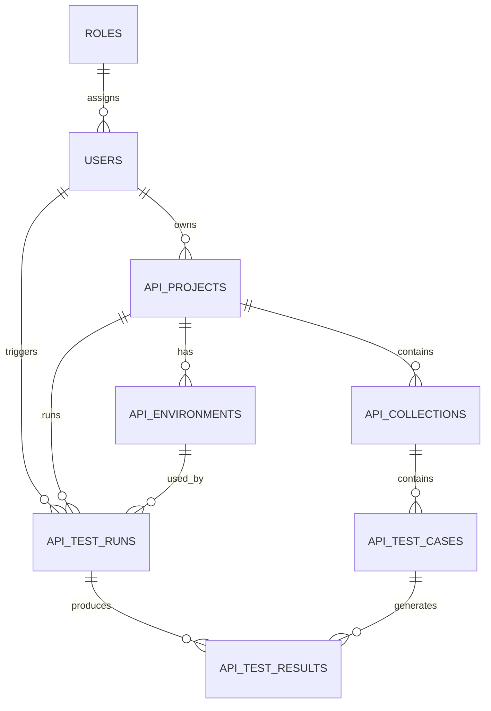

# 数据库设计

> 范围：API 自动化测试平台 MVP。  
> 原则：只保留 API 测试闭环必须的数据模型，避免提前设计多租户、复杂权限和分布式任务表。

---

## 1. 核心实体

| 表 | 说明 |
|----|------|
| `users` | 平台用户 |
| `roles` | 简单角色 |
| `api_projects` | API 测试项目 |
| `api_environments` | 项目环境配置 |
| `api_collections` | 用例集合 |
| `api_test_cases` | API 测试用例 |
| `api_test_runs` | 执行批次 |
| `api_test_results` | 单条执行结果 |

---

## 2. ER 图



---

## 3. 表结构

### 3.1 `roles`

| 字段 | 类型 | 约束 | 说明 |
|------|------|------|------|
| `id` | UUID | PK | 角色 ID |
| `name` | VARCHAR(50) | UNIQUE, NOT NULL | 角色名 |
| `description` | VARCHAR(255) | NULL | 描述 |
| `permissions` | JSON | NULL | 权限点列表 |
| `is_system` | BOOLEAN | NOT NULL | 系统角色不可删除 |
| `created_at` | TIMESTAMP | NOT NULL | 创建时间 |
| `updated_at` | TIMESTAMP | NOT NULL | 更新时间 |

### 3.2 `users`

| 字段 | 类型 | 约束 | 说明 |
|------|------|------|------|
| `id` | UUID | PK | 用户 ID |
| `username` | VARCHAR(50) | UNIQUE, NOT NULL | 用户名 |
| `email` | VARCHAR(255) | UNIQUE, NOT NULL | 邮箱 |
| `hashed_password` | VARCHAR(255) | NOT NULL | 哈希密码 |
| `nickname` | VARCHAR(100) | NULL | 昵称 |
| `phone` | VARCHAR(20) | NULL | 手机号 |
| `status` | INT | NOT NULL | `1` 启用，`0` 禁用 |
| `role_id` | UUID | FK | 当前角色 |
| `is_superuser` | BOOLEAN | NOT NULL | 超级管理员 |
| `last_login_time` | TIMESTAMP | NULL | 最后登录时间 |
| `created_at` | TIMESTAMP | NOT NULL | 创建时间 |
| `updated_at` | TIMESTAMP | NOT NULL | 更新时间 |

### 3.3 `api_projects`

| 字段 | 类型 | 约束 | 说明 |
|------|------|------|------|
| `id` | UUID | PK | 项目 ID |
| `name` | VARCHAR(100) | NOT NULL | 项目名称 |
| `description` | TEXT | NULL | 项目描述 |
| `owner_id` | UUID | FK -> users.id | 创建者 |
| `created_at` | TIMESTAMP | NOT NULL | 创建时间 |
| `updated_at` | TIMESTAMP | NOT NULL | 更新时间 |

> `base_url` 属于环境差异，放在环境表，不放在项目表。

### 3.4 `api_environments`

| 字段 | 类型 | 约束 | 说明 |
|------|------|------|------|
| `id` | UUID | PK | 环境 ID |
| `project_id` | UUID | FK | 所属项目 |
| `name` | VARCHAR(50) | NOT NULL | 环境名称 |
| `base_url` | VARCHAR(500) | NOT NULL | 基础地址 |
| `headers` | JSON | NULL | 公共请求头 |
| `variables` | JSON | NULL | 环境变量 |
| `is_default` | BOOLEAN | NOT NULL | 是否默认 |
| `created_at` | TIMESTAMP | NOT NULL | 创建时间 |
| `updated_at` | TIMESTAMP | NOT NULL | 更新时间 |

建议约束：同一项目下环境名称唯一。

### 3.5 `api_collections`

| 字段 | 类型 | 约束 | 说明 |
|------|------|------|------|
| `id` | UUID | PK | 集合 ID |
| `project_id` | UUID | FK | 所属项目 |
| `name` | VARCHAR(100) | NOT NULL | 集合名称 |
| `description` | TEXT | NULL | 描述 |
| `sort_order` | INT | NOT NULL | 排序 |
| `created_at` | TIMESTAMP | NOT NULL | 创建时间 |
| `updated_at` | TIMESTAMP | NOT NULL | 更新时间 |

MVP 只做一层集合，多级目录后续再扩展。

### 3.6 `api_test_cases`

| 字段 | 类型 | 约束 | 说明 |
|------|------|------|------|
| `id` | UUID | PK | 用例 ID |
| `project_id` | UUID | FK | 项目 ID，便于权限和查询 |
| `collection_id` | UUID | FK | 所属集合 |
| `name` | VARCHAR(200) | NOT NULL | 用例名称 |
| `method` | VARCHAR(10) | NOT NULL | HTTP 方法 |
| `path` | VARCHAR(500) | NOT NULL | 请求路径 |
| `headers` | JSON | NULL | 请求头 |
| `query_params` | JSON | NULL | 查询参数 |
| `body_type` | VARCHAR(20) | NOT NULL | none/json/form/raw |
| `body` | JSON | NULL | 请求体 |
| `assertions` | JSON | NULL | 断言规则 |
| `timeout_seconds` | INT | NOT NULL | 超时时间 |
| `status` | INT | NOT NULL | 启用状态 |
| `sort_order` | INT | NOT NULL | 排序 |
| `created_at` | TIMESTAMP | NOT NULL | 创建时间 |
| `updated_at` | TIMESTAMP | NOT NULL | 更新时间 |

### 3.7 `api_test_runs`

| 字段 | 类型 | 约束 | 说明 |
|------|------|------|------|
| `id` | UUID | PK | 执行批次 ID |
| `project_id` | UUID | FK | 所属项目 |
| `environment_id` | UUID | FK | 使用环境 |
| `name` | VARCHAR(200) | NOT NULL | 执行名称 |
| `scope` | VARCHAR(20) | NOT NULL | case/collection/project |
| `status` | VARCHAR(20) | NOT NULL | pending/running/finished/failed/canceled |
| `total_count` | INT | NOT NULL | 总数 |
| `passed_count` | INT | NOT NULL | 通过数 |
| `failed_count` | INT | NOT NULL | 失败数 |
| `skipped_count` | INT | NOT NULL | 跳过数 |
| `duration_ms` | INT | NOT NULL | 总耗时 |
| `triggered_by` | UUID | FK -> users.id | 触发者 |
| `started_at` | TIMESTAMP | NULL | 开始时间 |
| `finished_at` | TIMESTAMP | NULL | 结束时间 |
| `created_at` | TIMESTAMP | NOT NULL | 创建时间 |
| `updated_at` | TIMESTAMP | NOT NULL | 更新时间 |

### 3.8 `api_test_results`

| 字段 | 类型 | 约束 | 说明 |
|------|------|------|------|
| `id` | UUID | PK | 结果 ID |
| `run_id` | UUID | FK | 执行批次 |
| `test_case_id` | UUID | FK | 对应用例 |
| `status` | VARCHAR(20) | NOT NULL | passed/failed/skipped/error |
| `request_data` | JSON | NULL | 实际请求快照 |
| `response_data` | JSON | NULL | 响应快照 |
| `assertion_results` | JSON | NULL | 断言结果 |
| `duration_ms` | INT | NOT NULL | 耗时 |
| `error_message` | TEXT | NULL | 错误信息 |
| `executed_at` | TIMESTAMP | NOT NULL | 执行时间 |
| `created_at` | TIMESTAMP | NOT NULL | 创建时间 |
| `updated_at` | TIMESTAMP | NOT NULL | 更新时间 |

---

## 4. 索引建议

```sql
CREATE INDEX idx_users_username ON users(username);
CREATE INDEX idx_users_email ON users(email);
CREATE INDEX idx_users_role_id ON users(role_id);

CREATE INDEX idx_api_projects_owner_id ON api_projects(owner_id);

CREATE INDEX idx_api_environments_project_id ON api_environments(project_id);
CREATE UNIQUE INDEX uq_api_environments_project_name ON api_environments(project_id, name);

CREATE INDEX idx_api_collections_project_id ON api_collections(project_id);

CREATE INDEX idx_api_test_cases_project_id ON api_test_cases(project_id);
CREATE INDEX idx_api_test_cases_collection_id ON api_test_cases(collection_id);
CREATE INDEX idx_api_test_cases_status ON api_test_cases(status);

CREATE INDEX idx_api_test_runs_project_id ON api_test_runs(project_id);
CREATE INDEX idx_api_test_runs_environment_id ON api_test_runs(environment_id);
CREATE INDEX idx_api_test_runs_status ON api_test_runs(status);
CREATE INDEX idx_api_test_runs_triggered_by ON api_test_runs(triggered_by);

CREATE INDEX idx_api_test_results_run_id ON api_test_results(run_id);
CREATE INDEX idx_api_test_results_test_case_id ON api_test_results(test_case_id);
CREATE INDEX idx_api_test_results_status ON api_test_results(status);
```

---

## 5. 设计取舍

- 用户先绑定单角色，避免复杂 IAM。
- 不保存前置/后置脚本，避免远程代码执行风险。
- 执行结果保存请求和响应快照，保证历史可追溯。
- 项目表不保存 Base URL，所有环境差异都进入环境表。
