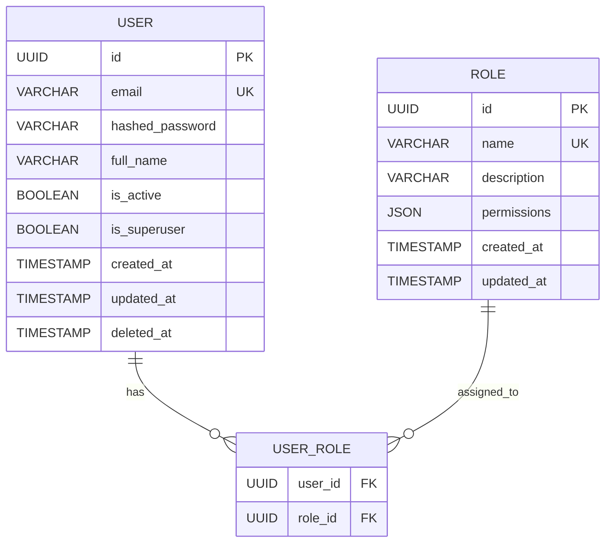
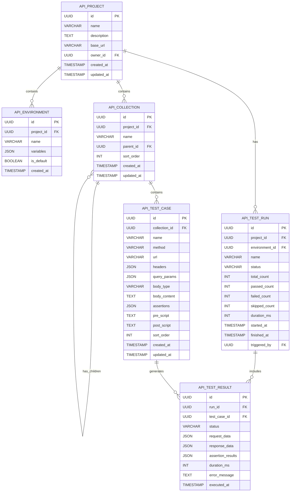
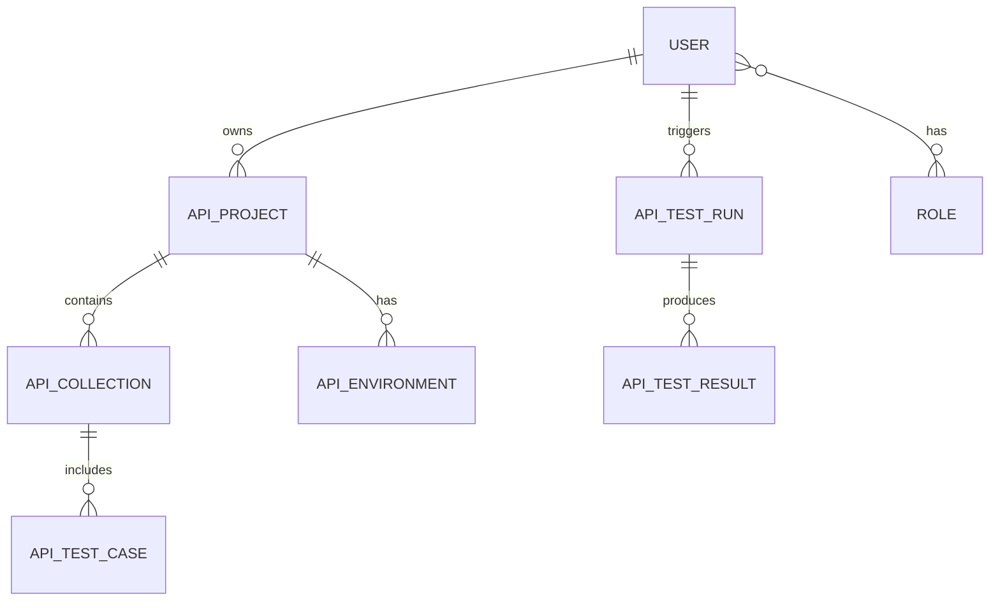

# ER图设计文档

## 1. 用户模块 ER图



## 2. API测试模块 ER图



## 3. 完整 ER图关系



## 4. 表结构详细设计

### 4.1 User 用户表

| 字段名 | 类型 | 约束 | 说明 |
|--------|------|------|------|
| id | UUID | PK | 用户ID |
| email | VARCHAR(255) | UNIQUE, NOT NULL | 邮箱 |
| hashed_password | VARCHAR(255) | NOT NULL | 加密密码 |
| full_name | VARCHAR(100) | NOT NULL | 姓名 |
| is_active | BOOLEAN | DEFAULT TRUE | 是否启用 |
| is_superuser | BOOLEAN | DEFAULT FALSE | 是否管理员 |
| created_at | TIMESTAMP | DEFAULT NOW() | 创建时间 |
| updated_at | TIMESTAMP | AUTO UPDATE | 更新时间 |
| deleted_at | TIMESTAMP | NULLABLE | 软删除时间 |

### 4.2 Role 角色表

| 字段名 | 类型 | 约束 | 说明 |
|--------|------|------|------|
| id | UUID | PK | 角色ID |
| name | VARCHAR(50) | UNIQUE, NOT NULL | 角色名称 |
| description | VARCHAR(255) | | 角色描述 |
| permissions | JSON | | 权限列表 |
| created_at | TIMESTAMP | DEFAULT NOW() | 创建时间 |
| updated_at | TIMESTAMP | AUTO UPDATE | 更新时间 |

### 4.3 ApiProject API项目表

| 字段名 | 类型 | 约束 | 说明 |
|--------|------|------|------|
| id | UUID | PK | 项目ID |
| name | VARCHAR(100) | NOT NULL | 项目名称 |
| description | TEXT | | 项目描述 |
| base_url | VARCHAR(500) | | 基础URL |
| owner_id | UUID | FK -> User.id | 创建者 |
| created_at | TIMESTAMP | DEFAULT NOW() | 创建时间 |
| updated_at | TIMESTAMP | AUTO UPDATE | 更新时间 |

### 4.4 ApiEnvironment 环境配置表

| 字段名 | 类型 | 约束 | 说明 |
|--------|------|------|------|
| id | UUID | PK | 环境ID |
| project_id | UUID | FK -> ApiProject.id | 所属项目 |
| name | VARCHAR(50) | NOT NULL | 环境名称 |
| variables | JSON | | 环境变量 |
| is_default | BOOLEAN | DEFAULT FALSE | 是否默认环境 |
| created_at | TIMESTAMP | DEFAULT NOW() | 创建时间 |

### 4.5 ApiCollection 测试集合表

| 字段名 | 类型 | 约束 | 说明 |
|--------|------|------|------|
| id | UUID | PK | 集合ID |
| project_id | UUID | FK -> ApiProject.id | 所属项目 |
| name | VARCHAR(100) | NOT NULL | 集合名称 |
| parent_id | UUID | FK -> ApiCollection.id | 父目录 |
| sort_order | INT | DEFAULT 0 | 排序 |
| created_at | TIMESTAMP | DEFAULT NOW() | 创建时间 |
| updated_at | TIMESTAMP | AUTO UPDATE | 更新时间 |

### 4.6 ApiTestCase 测试用例表

| 字段名 | 类型 | 约束 | 说明 |
|--------|------|------|------|
| id | UUID | PK | 用例ID |
| collection_id | UUID | FK -> ApiCollection.id | 所属集合 |
| name | VARCHAR(200) | NOT NULL | 用例名称 |
| method | VARCHAR(10) | NOT NULL | HTTP方法 |
| url | VARCHAR(500) | NOT NULL | 请求URL |
| headers | JSON | | 请求头 |
| query_params | JSON | | 查询参数 |
| body_type | VARCHAR(50) | | 请求体类型 |
| body_content | TEXT | | 请求体内容 |
| assertions | JSON | | 断言规则 |
| pre_script | TEXT | | 前置脚本 |
| post_script | TEXT | | 后置脚本 |
| sort_order | INT | DEFAULT 0 | 排序 |
| created_at | TIMESTAMP | DEFAULT NOW() | 创建时间 |
| updated_at | TIMESTAMP | AUTO UPDATE | 更新时间 |

### 4.7 ApiTestRun 测试执行表

| 字段名 | 类型 | 约束 | 说明 |
|--------|------|------|------|
| id | UUID | PK | 执行ID |
| project_id | UUID | FK -> ApiProject.id | 所属项目 |
| environment_id | UUID | FK -> ApiEnvironment.id | 执行环境 |
| name | VARCHAR(200) | NOT NULL | 执行名称 |
| status | VARCHAR(20) | NOT NULL | 状态 |
| total_count | INT | DEFAULT 0 | 总用例数 |
| passed_count | INT | DEFAULT 0 | 通过数 |
| failed_count | INT | DEFAULT 0 | 失败数 |
| skipped_count | INT | DEFAULT 0 | 跳过数 |
| duration_ms | INT | DEFAULT 0 | 执行时长 |
| started_at | TIMESTAMP | | 开始时间 |
| finished_at | TIMESTAMP | | 结束时间 |
| triggered_by | UUID | FK -> User.id | 触发者 |

### 4.8 ApiTestResult 测试结果表

| 字段名 | 类型 | 约束 | 说明 |
|--------|------|------|------|
| id | UUID | PK | 结果ID |
| run_id | UUID | FK -> ApiTestRun.id | 所属执行 |
| test_case_id | UUID | FK -> ApiTestCase.id | 测试用例 |
| status | VARCHAR(20) | NOT NULL | 执行状态 |
| request_data | JSON | | 实际请求 |
| response_data | JSON | | 响应数据 |
| assertion_results | JSON | | 断言结果 |
| duration_ms | INT | DEFAULT 0 | 执行时长 |
| error_message | TEXT | | 错误信息 |
| executed_at | TIMESTAMP | DEFAULT NOW() | 执行时间 |

## 5. 索引设计

```sql
-- User表索引
CREATE INDEX idx_user_email ON users(email);

-- ApiProject表索引
CREATE INDEX idx_api_project_owner ON api_projects(owner_id);

-- ApiCollection表索引
CREATE INDEX idx_api_collection_project ON api_collections(project_id);
CREATE INDEX idx_api_collection_parent ON api_collections(parent_id);

-- ApiTestCase表索引
CREATE INDEX idx_api_test_case_collection ON api_test_cases(collection_id);

-- ApiTestRun表索引
CREATE INDEX idx_api_test_run_project ON api_test_runs(project_id);
CREATE INDEX idx_api_test_run_status ON api_test_runs(status);

-- ApiTestResult表索引
CREATE INDEX idx_api_test_result_run ON api_test_results(run_id);
CREATE INDEX idx_api_test_result_case ON api_test_results(test_case_id);